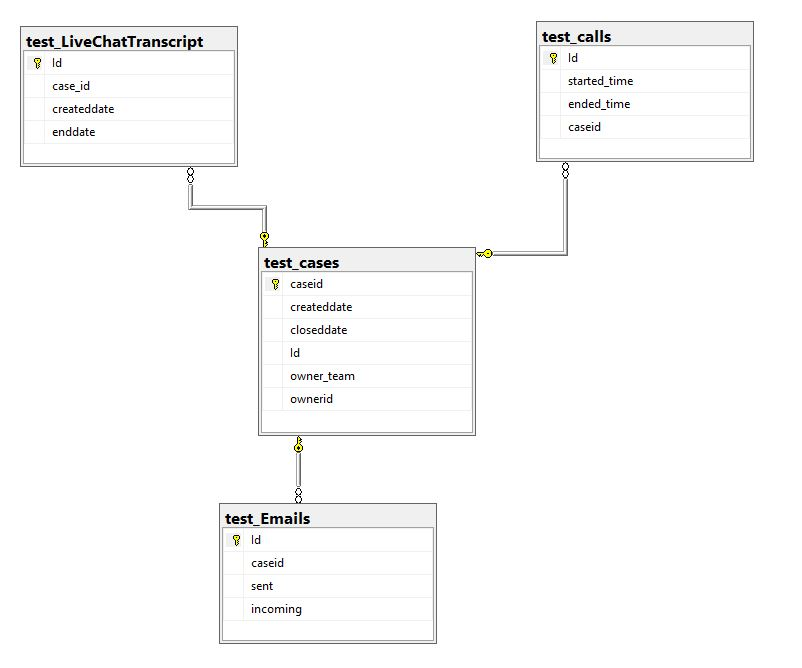
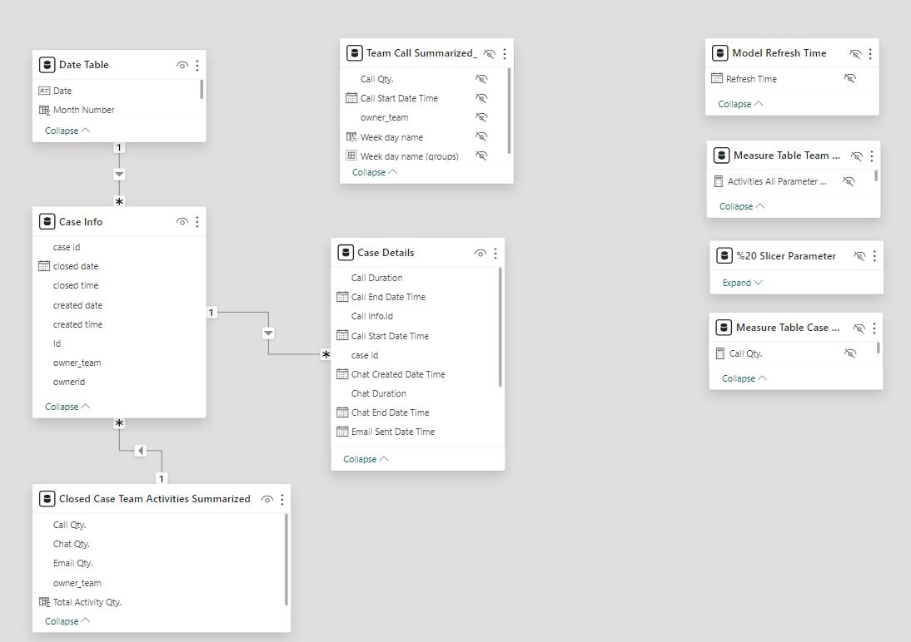

# PowerBI reporting solution
This repo has scripts, PowerBI files, excel files related for a task solution and data profiling operations, IPYNB notebooks related to SQL task.
Overall, task solution has seperated into 4 section as defined below,

## Data Profiling;
First, shared scripts by task sender used on SSMS to create tables that will be used as source database for solution. After running shared scripts It is seen that there are 4 tables loaded with data as

a)dbo.test_cases  
b)dbo.test_Emails  
c)dbo.test_calls  
d)dbo.test_LiveChatTranscript  

For to showcase python capabilities, data profiling made by custom made python modules (by myself dat and sql_profiler module). Source code related to modules can be found on https://github.com/Giray18/power_bi_reporting_solution/tree/main/src .

These modules has run python based data profiling methods and saves output of profiled data into a date partitioned auto created folder that can be reached by location https://github.com/Giray18/power_bi_reporting_solution/tree/main/data_profiling_results/2024-08-16 in excel format. 

As a result for 4 database table 4 data profiling output xlsx files created and based on the initial check It has been understood that there is 1 dim (test_cases) and 3 fact tables (test_Emails, test_LiveChatTranscript, test_calls) being used on database. Below size of tables can be seen with detected unique value holding columns

a)dbo.test_cases // 1579 rows * 6 columns - (caseid - Id)  
b)dbo.test_Emails // 13335 rows * 4 columns - (Id)  
c)dbo.test_calls // 17 rows * 4 columns - (id, started_time, ended_time)  
d)dbo.test_LiveChatTranscript // 567 rows * 4 columns - (Id)  

Below diagram created on SSMS and FK constraints established according to caseid column between tables.

 

## SQL Task Solution;
As per requirements of task, queries written to get data asked by below 2 inquiries. Solution created in 2 different methods first by using python method used on Data Profiling section (sql_profiler module), second as native T-SQL queries.

* Which teams had the shortest and the longest average duration of chats?
* Which team had the lowest average response time between first incoming email and the next call. What was the average for this team?

First solution is shown on jupyter notebook attachment can be found on https://github.com/Giray18/power_bi_reporting_solution/tree/main/jupyter_notebooks .

Second solution`s output files can be found on https://github.com/Giray18/power_bi_reporting_solution/tree/main/t-sql_queries .

## Excel Task Solution;
As per task requirements there is a pivot table creation task based on source data. Since I created my source files on SSMS database, I used Excel native SSMS connector to gather data into excel. After ingestion, I applied pivot table steps to gather solution`s required data which can be found on https://github.com/Giray18/power_bi_reporting_solution/tree/main/excel_task .

## Power BI Task Solution;
3 reports created based on requirements defined on PowerBI section of the task document.  

As a general rule; For to bring more comprehensive subject based understanding to descriptive analysis done on PowerBI, additionnal visuals created with extra metrics asked on the task.

Various methods used to show variety of capabilities while creating visuals like PowerQuery M language or DAX. Making calculations based on created table or column or using filter context by DAX formulation. Since dataset/model is in tiny size performance considerations are not taken into consideration in detailed way.

Data model transformed in Power Query to apply some PowerBI best practices like Star schema and Date Table. Some summarized tables also used.

Below PowerBI data Model can be seen;

Case details table as fact table created by left joining dbo.test_calls,dbo.test_emails,dbo.test_LiveChatTranscript tables to dbo.test_cases table. On fact table case related activities gathered.

Other case related details stayed on Case Info table which is created from dbo.test_cases table.

There are some disconneted tables on the model to be used on slicers, parameters and some other visuals does not depend our source data.

 

**Report details are as below;**

**Info page:** Gives brief info about reports and their visuals to users.

**On first report:** Named as Team Activities; Visualitions created to reflect below inquiries answers.
Weekday Slicer and Percent % Slicer bringing required data into tree map visuals.
Percent % slicer both work for top %20 and bottom % 20 calculations.
Additional, matrix view and card visuals put on report to give more detailed descriptive analysis of team performance.

* What teams were in top 20% by number of daily taken calls 1) on weekdays and 2) on weekends?
* What teams were in bottom 20% of total activities (emails, chats and calls), for all closed cases?

**On second report:** Named as Case Details Report; Visualizations created as requested by below items.
Slicers on left panel working in cascade fashion. On top 3 card visuals shows quantity of activities per case id grouped by activity type.

* Case summary visualization filters for team and case create date. 
* The case summary visualization will have the following columns: case IDs, and case details (created date, closed date, owner ID, and team). 
* Case detail visualization filter for “create date”. For calls this is the start date, for email it is the sent date, for chat it is the create date.
* The case detail visualization will display case activity details for the cases displayed in the case summary. This means the case detail visualization will respect the team and date filter for the summary visualization. Furthermore if the report user selects a case (or cases) in the case summary visualization only these case activities will appear in the detail visualization.
* The activity details to display are:
	• Case ID
	• Type of Activity (email, chat or call)
	• For calls  - start date/time, end date/time and duration
	• For email – send date/time and incoming flag (as Yes/No)
	• For chat – create date/time, end date/time and duration.

PBIX file can be found on https://github.com/Giray18/power_bi_reporting_solution/tree/main/power_bi_pbix

PBIP file can be found on https://github.com/Giray18/power_bi_reporting_solution/tree/main/power_bi_project_final
